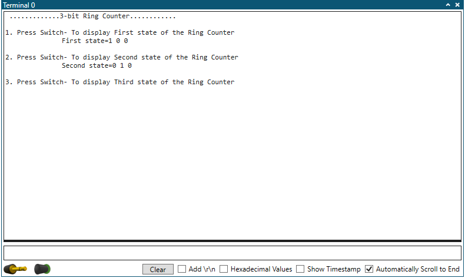
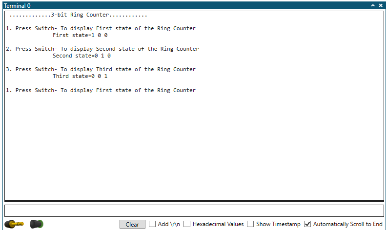
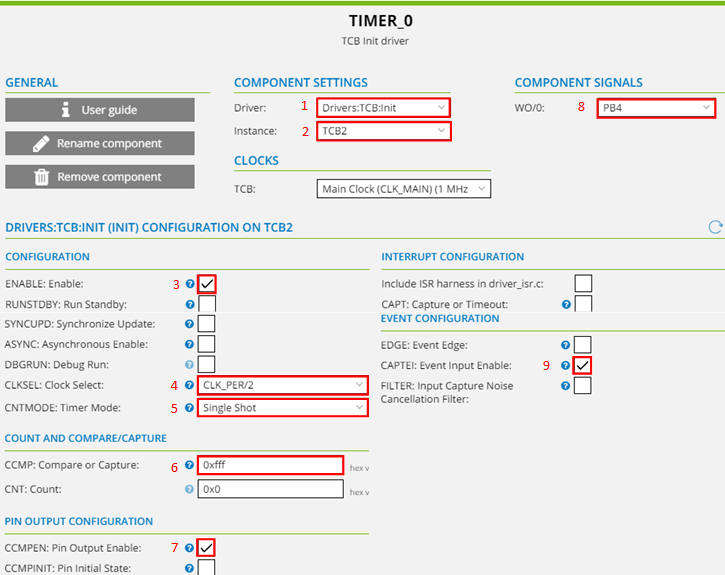

<!-- Please do not change this html logo with link -->

## Introduction
  
The Configurable Custom Logic (CCL) is a Core Independent Peripheral (CIP), which means it performs its tasks with no code or supervision from the CPU after configuration is completed. The CCL module is a programmable logic block and can be used to implement Combinational or Sequential logic functions. Since the logic functions implemented in the hardware have faster event response compared to the logic functions implemented in the software, the CCL gives the advantage of faster and predictable response to the users. This example demonstrates  3-bit ring counter implementation  using all 6 Look-Up-tables (LUTs) available with the CCL peripheral of AVR128DA48 MCU.

**Note:** **This example could be generated with 48 and 64 pin AVR-DA devices.**

#### To see the 3bit ring counter demo operation video, click on the below image.

 

## Useful Links

- [AVR128DA48 Product Page](https://www.microchip.com/wwwproducts/en/AVR128DA28 "AVR128DA48 Product Page")
- [AVR128DA48 Code Examples on GitHub](https://github.com/microchip-pic-avr-examples?q=avr128da48 "AVR128DA48 Code Examples on GitHub")
- [AVR128DA48 Project Examples in START](https://start.atmel.com/#examples/AVR128DA48CuriosityNano "AVR128DA48 Project Examples in START")
- [3bit Ring Counter - MPLAB Example](https://github.com/microchip-pic-avr-examples/avr128da48-3bit-ring-counter-mcc-example.git "3bit Ring Counter - MPLAB Example")

## Basics of Ring Counter: 
The ring counter is a type of counter composed of flipflops connected into a shift register, with the output of the last flipflop fed to the input of the first flipflop, making a circular or ring in structure. It is a synchronous counter which as a common clock signal that triggers all the flipflops at the same time. It is initialized such that only one of the flipflop output is 1 while the remainder is 0. Number of states of Ring counter is equal to number of flipflops used. To design three-bit ring counter, three flipflops are required. 

The sequence of output from the three-bit ring counter is: 

  
   <strong>Table 1: Output states of 3bit ring counter  

## Demo Description            

  
   <strong>Fig 1: Block diagram of three-bit Ring Counter  

                       
In this example,
* The AVR128DA48 Curiosity Nano board from Microchip is used to realize the 3-bit Ring Counter.
* To realize 3-bit Ring Counter, 3 D flip-flops are required. A pair of LUTs is needed to realize one D flip-flop. All the 6 LUTs are used to realize 3 D flip-flops.
* LUT0 and LUT1 are configured together as D flip-flop 0, LUT2 and LUT3 are configured together as D flip-flop 1, and LUT4 and LUT5 are configured together as D flip-flop 2.
* These three D flip-flops are cascaded in such a way that output of D flip-flop 0 is fed to the input of D flip-flop 1, D flip-flop 1 output is fed to the D flip-flop 2 input and, D flip-flop 2 output is fed to the D flip-flop 0 input through Event system, to complete the required ring counter circuit as shown in below Fig 2. 

  
   <strong>Fig 2:Cascaded connections of three D-flipflops  

 

* The even LUTs (i.e. LUT0/LUT2/LUT4) are configured to produce custom logic gate. The output of the Timer B, which is used as a clock signal is applied only to even LUTs. 
* All three inputs (i.e. Input (GPIO), Timer B (CLK), feedback of LUT4) is fed only to the first flipflop of LUT0 and value 0XEE is loaded in the truth table.
* A GPIO input connected to an even LUT0 is used to generate a Set pulse only to the first flipflop, and before the clock signal is applied, this allows feeding logic “1” value to the ring counter circuit. After reading the first flipflop output, GPIO is configured to feed a logic “0” value. 
* LUT2 and LUT4 are fed with only two inputs (i.e. Timer B (CLK), feedback input) and value 0XCC is loaded in the truth table.
* The odd LUTs (i.e. LUT1/LUT3/LUT5) are configured as OR gate and value 0X10 is loaded in the truth table.
* A GPIO connected to the odd LUTs is configured to generate a logic “1” signal to the LUTs, in order to pass the signals fed as an input to the even LUTs when the CLK signal is applied.
* For each clock signal, the data shift by one position among the three flipflops of ring counter circuit.
* The on-board mechanical switch (SW0) is used as a trigger for the Timer B to generate a single pulse, which is used as a clock signal to all the three flipflops.
* For each switch press event, data gets shifted from output of the D flip-flip 0 to the D flip-flop 1 input, D flip-flop 1 output to the D flip-flop 2 input and, D flip-flop 2 output to the D flip-flop 0 input.
* First state of the ring counter is displayed on the terminal window, without a switch press event, only once at the start of the functionality. Next time onwards, a switch press event is required to display the first state of the ring counter.
* The on-board indication LED blinks, whenever a switch (SW0) press event is reported. 
* The 3-bit ring counter data gets transferred to the terminal window of  data visualizer tool through mEDBG of the AVR128DA48 Curiosity Nano board.

## Hardware used

* AVR128DA48 Curiosity Nano Evaluation Kit [[Part Number:DM164151]](https://www.microchip.com/DevelopmentTools/ProductDetails/PartNO/DM164151 "[Part Number:DM164151]")

  
   <strong>Fig 3 : AVR128DA48 Curiosity Nano Evaluation Kit 

## Software Used
- Atmel Studio 7.0.2397 [link](https://www.microchip.com/mplab/avr-support/atmel-studio-7 "link")
- AVR/GNU C Compiler [link](https://www.microchip.com/mplab/avr-support/avr-and-arm-toolchains-c-compilers "link")
- Atmel START [link](https://www.microchip.com/mplab/avr-support/atmel-start "link")
- AVR-Dx DFP 1.0.27
- Standalone Data Visualizer v2.20.674 [link](https://www.microchip.com/mplab/avr-support/data-visualizer "link")

**Note: For running the demo, the installed tool versions should be the same or later. This example is not tested with the previous versions.**

## Steps to open Terminal window in Data Visualizer:

Open the Terminal window in Standalone Data Visualizer tool to observe the data of the ring counter and follow the below mentioned steps to open terminal window.

1.	In the Data Visualizer window, click on the **Configuration tab**.
2.	In the **Modules section**, expand **External connection** option and then double click on Serial Port.
3.	Select the **Curiosity Virtual Com Port** in Serial Port Control Panel.
4.	Set the Baud rate to 9600.
5.	Check the **“Open Terminal”** option.
6.	Click on the **Connect button**.

  

## Demo Operation:

* After the Curiosity Nano board is powered on, load the firmware to AVR128DA48 MCU as explained in the Device Programming section.
* Before each switch press, read the instructions provided on the terminal window. E.g. Press switch- To display first state of the Ring Counter.
* Observe first state of the ring counter is displayed by default on the terminal window, only once at the start of the functionality, without a switch press event. The text displayed on the terminal window is “First state=1 0 0”.

  

* After the first state is displayed on terminal window, user needs to wait for the next instruction to be displayed on terminal window. 
* Press Switch (SW0) to display the second state of the ring counter and observe the text “Second state = 0 1 0” is displayed on terminal window.
* Observe the next instruction to the user is displayed on terminal window.

  

* Press Switch (SW0) to display the third state of the ring counter and observe the text “Third state = 0 0 1” is displayed on terminal window.
* Observe again the first instruction to the user is displayed on terminal window.
* Press Switch (SW0) to display the first state of the ring counter on the terminal window.

  

# Conclusion:
This example demonstrates configuration and usage of CIP’s (Core Independent Peripherals), such as CCL and Event System in the application. This example also explains realization of 3-bit Ring Counter using all the 6 LUTs  of CCL peripheral available on the AVR128DA48 MCU. 

  The usage of CCL peripheral provides predictable response time, reduces firmware complexity and offers component integrity by allowing sequential logic gates realization without the need for on-board Programmable Logic Devices (PLDs). Thereby reducing BOM cost and speed up time to market for the new products. 

# Appendix:  Atmel | START Project Creation

Configure CCL, Event system, Timer, GPIO, Pin change interrupt, USART peripherals and generate project in Atmel|START. Follow the below steps to generate the project in Atmel|START.

1.  Open **Atmel Studio 7**.
2.  Go to **File → New** and click on **Atmel Start Project** option.
3.  The **CREATE NEW PROJECT** window appears within Atmel Studio 7.In the **"Filter on device..."** text box, enter **AVR128DA48**, then select **AVR128DA48 Curiosity Nano** from the list and then click on **CREATE NEW PROJECT**, as shown below.Wait until project creation is completed.

  

4.   Open **PINMUX** configuration by clicking on icon in the navigation tab, located on the left side of the window.
       * Pin **PC6** is configured as output to control **LED**, which is available on AVR128DA48 Curiosity nano board. When on-board switch (SW0) of CNANO is pressed, the LED blinks to indicate the user that switch is pressed.

  

* Pin **PC7** is configured in advanced mode to detect switch press events, which is available on AVR128DA48 Curiosity nano board.

  

* Configure pin **PA1** in input mode and feed as input signal to the first flipflop.

  

6.  Add Timer, Event system, USART and CCL peripheral drivers to the project
       * Click icon in the navigation tab, located on the left side of the window. Then, 
open the **ADD SOFTWARE COMPONENTS** window by clicking icon.
       * Expand Drivers by clicking + icon.
       * To add respective drivers to the project  select Timer, Event System, CCL, USART and click on icon.
       * Add the respective drivers to the project by clicking the Add component(s).

  

# Timer B Configuration:
Timer B is a 16-bit Timer which is configured in a Single Shot Mode and it generates a Single pulse which is used as a Clock signal for all the three D flipflops. The output of all the three D-flipflops changes with respective to this clock signal.  Configure the Timer_0 module by following the steps shown in the below figure. 
* Open the configuration window for TIMER by clicking on **TIMER_0**.
* Select **Drivers: TCB: Init** option from the dropdown menu against the **Driver** field.
* Select **TCB2** option from the dropdown menu against the **Instance** field.
* Select **PB4** as output from the dropdown menu against the **WO/0** field.

  

* Check the **Enable** option to enable the TCB2 module.
* Select **CLK_PER/2 (From Prescaler)** option from the dropdown menu against the **CLKSEL:Clock Select** field.
* Select **Single Shot mode** option from the dropdown menu against the **CNTMODE: Timer Mode** field.
* Enter value **0xfff** (which is equivalent to 4095) against **CCMP: Compare or Capture** field.
* Check the CCMPEN: Pin Output Enable field. This will enable the Timer waveform output on the corresponding pin.
* Check the **CAPTEI: Event Input Enable** field.

  

# USART1 Configuration: 
USART1 is used to transmit the three states of the ring counter on the terminal window (i.e. First state=100/Second state=010/Third state=011). The USART1 peripheral is also used to display the instructions to the user on the terminal window. Configure the USART1 module by following the steps shown in the below figure.   
* Open the configuration window for USART by clicking on **USART_0**.
* Select **Drivers: USART: Basic** option from the dropdown menu against the **Driver** field.
* Select **USART1** option from the dropdown menu against the **Instance** field.
* Select **PC0** as output from the dropdown menu against the **TXD** field.

  

* Check the **Printf support** option, which allows to print a sequence of characters.
* Check the **Transmitter: Enable** option, which allows the data to transmit through USART peripheral.
* Set the **Baud Rate** to **9600**.

  

# Event System Configuration: 
In this example, event system is used to connect the output of D-flipflop 0 to the input of D-flipflop 1 and output of D-flipflop 1 to the input of D-flipflop 2 and output of D-flipflop 2 to the input of D-flipflop 0. Event system is also used to connect output of the Timer B (generates a single pulse, which is used as a clock signal) to LUT0, LUT2, LUT4.Configure the Event System module by following the steps shown in the below figure.
* Open the configuration window for Event System by clicking on **EVENT_SYSTEM_0**.
* Select the **Port A Pin2** option from the drop down menu as event generator against the **CHANNEL0: Event Channel 0 Generator**. Select **Connect user to event channel 0** option from the dropdown menu as event user against the **USERCCLLUT5A: User Channel 5 CCL_LUT5A Input Selection**.
* Select the **Port C Pin7** option from the dropdown menu as event generator against the **CHANNEL2: Event Channel 2 Generator**. Select **Connect user to event channel 2** option from the dropdown menu as event user against the **USERTCB2CAPT: User Channel TCB2_CAPT Input Selection**.
* Select the **Timer/Counter B2 Capture** option from the dropdown menu as event generator against the **CHANNEL3: Event Channel 3 Generator**. 
	* Select **Connect user to event channel 3** option from the dropdown menu as event user against the **USERCCLLUT0A: User Channel 3 CCL_LUT0A Input Selection**.
	* Select **Connect user to event channel 3** option from the dropdown menu as event user against the **USERCCLLUT2A: User Channel 3 CCL_LUT2A Input Selection**.
	* Select **Connect user to event channel 3** option from the dropdown menu as event user against the **USERCCLLUT4A: User Channel 3 CCL_LUT4A Input Selection**.

  

* Select **Configurable Custom Logic LUT0** option from the dropdown menu as event generator against the **CHANNEL4: Event Channel 4 Generator**. Select **Connect user to event channel 4** option from the dropdown menu as event user against the **USERCCLLUT2B: User Channel 4 CCL_LUT2B Input Selection**.
* Select **Configurable Custom Logic LUT2** option from the dropdown menu as event generator against the **CHANNEL5: Event Channel 5 Generator**. Select **Connect user to event channel 5** option from the dropdown menu as event user against the **USERCCLLUT4B: User Channel 5 CCL_LUT4B Input Selection**.
* Select **Configurable Custom Logic LUT4** option from the dropdown menu as event generator against the **CHANNEL6: Event Channel 6 Generator**. Select **Connect user to event channel 6** option from the dropdown menu as event user against the **USERCCLLUT0B: User Channel 6 CCL_LUT0B Input Selection**.

  

# CCL Configuration: 
To realize this example 3 D-flipflops are required. In CCL, LUT0 and LUT1 are configured together as a D-flipflop 0, LUT2 and LUT3 are configured together as a D-flipflop 1, LUT4 and LUT5 are configured together as a D-flipflop 2. Configure the CCL module by following the steps shown in the below figure.
* Open the configuration window for CCL by clicking on **DIGITAL_GLUE_LOGIC_0**.

  

* Select **LUT0_IN/1** on pin **PA1, LUT0_OUT/0** on pin **PA3, LUT0_IN/2** on pin **PC2, LUT2_OUT/0** on pin **PD3, LUT3_IN/2** on pin **PF2, LUT4_OUT/0** on pin **PB3**.

  

* Enable peripheral by selecting checkmark **ENABLE: Enable**.
* Select **D Flipflop** option from the dropdown menu against the **SEQSEL0: Sequential Selection 0, SEQSEL1: Sequential Selection 1, SEQSEL2: Sequential Selection 2**.

  

### Configurations to be done for LUT0:
* Select checkbox **LUTEN: LUT Enable** under **LOOKUP TABLE 0 CONFIGURATION**.
* Select checkbox **OUTEN: Output Enable** under **LOOKUP TABLE 0 CONFIGURATION**.
* Select **IN [2] is clocking the LUT** option from the dropdown menu against the **CLKSRC: Clock Source Selection**.
* Select **Event input source B** option from the dropdown menu against **INSEL0: LUT Input 0 Source Selection**. The output of the D-flipflop 2 (LUT 4) is given as input to the D-flipflop 0 through Event System, which is named as EVENT B.
* Select **IO pin LUTn-IN1 input source** option from the dropdown menu against **INSEL1: LUT Input 1 Source Selection**. IO input is fed only to the first flipflop. IO PA1 pin is configured as an output, which will feed logic “1” signal to the first flipflop.
* Select **Event input source A** option from the dropdown menu against **INSEL2: LUT Input 2 Source Selection**. The Single pulse generated by Timer B, which is used as a clock signal is fed to the LUT0 through Event System, which is named as EVENT A.
* Enter truth table value **TRUTH0: Truth 0** as **238** (or 0XEE).

  

### Configurations to be done for LUT1:
* Select checkbox **LUTEN: LUT Enable** under **LOOKUP TABLE 1 CONFIGURATION**.
* Select **IO pin LUTn-IN2 input source** option from the dropdown menu against **INSEL2: LUT Input 2 Source Selection**.PC2 pin is configured as an input and pull-up option is enabled which feeds a logic “1” signal to the LUT1.
* Enter truth table value **TRUTH1: Truth 1** as **16** (or 0X10).

  

### Configurations to be done for LUT2:
* Select checkbox **LUTEN: LUT Enable** under **LOOKUP TABLE 2 CONFIGURATION**.
* Select checkbox **OUTEN: Output Enable** under **LOOKUP TABLE 2 CONFIGURATION**.
* Select **IN [2] is clocking the LUT** option from the dropdown menu against the **CLKSRC: Clock Source Selection**.
* Select **Event input source B** option from the dropdown menu against **INSEL1: LUT Input 1 Source Selection**.The output of the D-flipflop 0 (LUT 4) is given as input to the D-flipflop 1 through Event System, which is named as EVENT B.
* Select **Event input source A** option from the dropdown menu against **INSEL2: LUT Input 2 Source Selection**.The Single pulse generated by Timer B, which is used as a clock signal is fed to the LUT0 through Event System, which is named as EVENT A.
* Enter truth table value **TRUTH2: Truth 2** as **204** (or 0xCC).

  

### Configurations to be done for LUT3:
* Select checkbox **LUTEN: LUT Enable** under **LOOKUP TABLE 3 CONFIGURATION**.
* Select **IO pin LUTn-IN2 input source** option from the dropdown menu against **INSEL2: LUT Input 2 Source Selection**.PF2 pin is configured as an input and pull-up option is enabled which feeds a logic “1” signal to the LUT3.
* Enter truth table value **TRUTH3: Truth 3** as **16** (or 0X10).

  

### Configurations to be done for LUT4:
* Select checkbox **LUTEN: LUT Enable** under **LOOKUP TABLE 4 CONFIGURATION**.
* Select checkbox **OUTEN: Output Enable** under **LOOKUP TABLE 4 CONFIGURATION**.
* Select **IN [2] is clocking the LUT** option from the dropdown menu against the **CLKSRC: Clock Source Selection**.
* Select **Event input source B** option from the dropdown menu against **INSEL1: LUT Input 1 Source Selection**.The output of the D-flipflop 1 (LUT 4) is given as input to the D-flipflop 2 through Event System, which is named as EVENT B.
* Select **Event input source A** option from the dropdown menu against **INSEL2: LUT Input 2 Source Selection**.The Single pulse generated by Timer B, which is used as a clock signal is fed to the LUT0 through Event System, which is named as EVENT A.
* Enter truth table value **TRUTH4: Truth 4** as **204** (or 0xCC).

  

### Configurations to be done for LUT5:
* Select checkbox **LUTEN: LUT Enable** under **LOOKUP TABLE 5 CONFIGURATION**.
* Select **Event input source A** option from the dropdown menu against **INSEL2: LUT Input 2 Source Selection**.PA2 pin is configured as an input and pull-up option is enabled, which feeds a logic “1” signal to the LUT5 through Event system, which is named as EVENTA.
* Enter truth table value **TRUTH5: Truth 5** as **16** (or 0X10).

  

